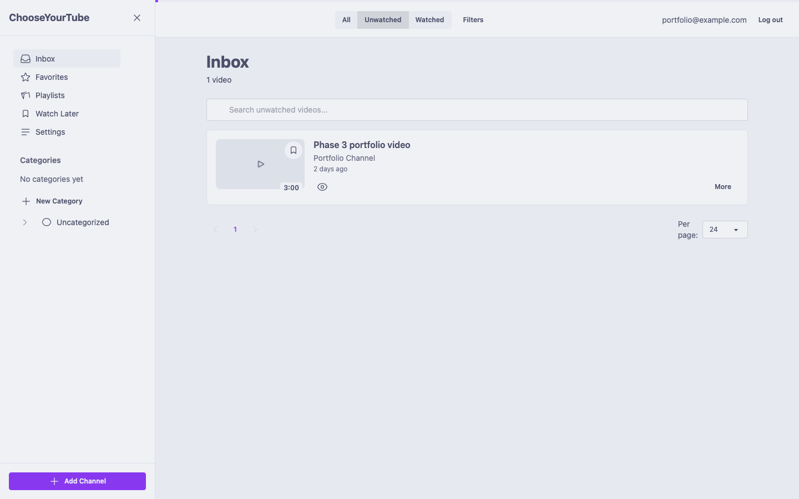
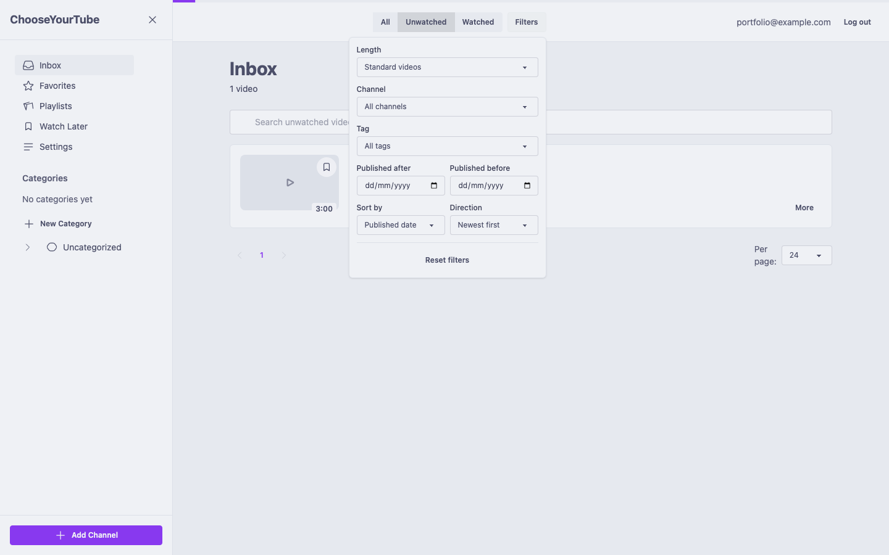
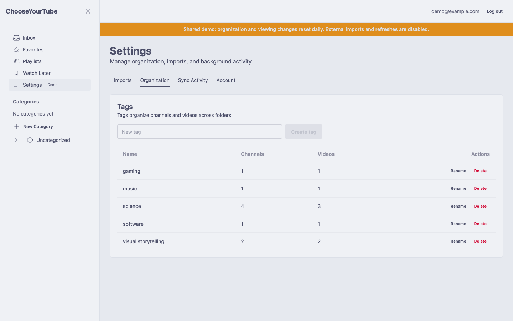
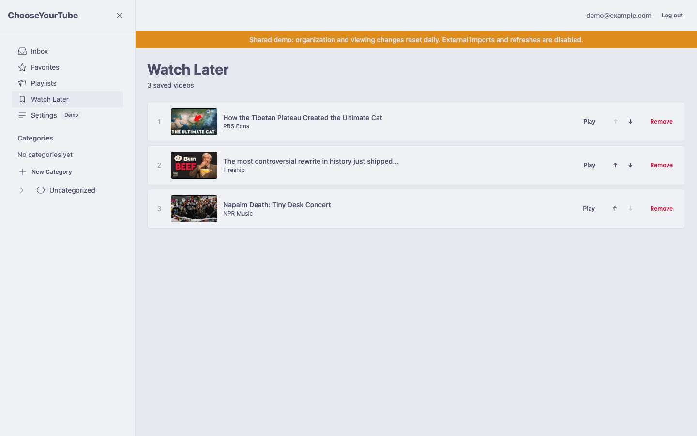
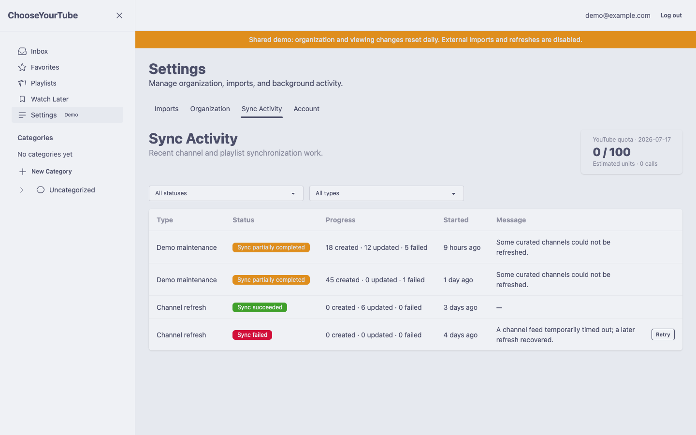
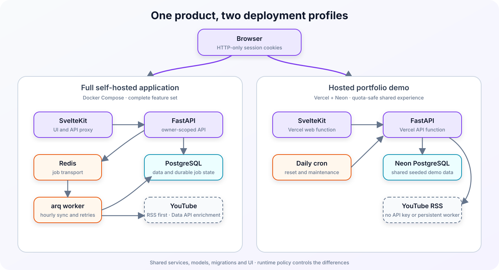

# ChooseYourTube

ChooseYourTube is a self-hosted YouTube inbox for people who want to follow channels without using
YouTube's recommendation feed. It collects new videos from selected channels in a searchable personal
library, with categories, tags, playlists, Watch Later, and watched-state tracking.

[Try the hosted demo](https://chooseyourtube-demo-tawny.vercel.app)



[](https://github.com/djdillybdev/ChooseYourTube/actions/workflows/ci.yml)
[](LICENSE)
[](docs/accessibility.md)

## What you can do

- Follow individual YouTube channels and browse their recent videos without recommendations,
  comments, trending content, or engagement prompts.
- Search video titles and descriptions, then combine channel, category, tag, date, duration, and
  watched-state filters. Filter state stays in the URL.
- Organize channels with categories, tags, and favorites.
- Save videos to Watch Later or ordered custom playlists.
- Import subscriptions from a Google Takeout CSV or through a one-time Google OAuth connection.
- Review synchronization progress, partial results, retries, and YouTube API quota use.
- Keep accounts and libraries separate through owner-scoped data access.

| Browse and combine filters                                                | Organize channels and tags                                              |
| ------------------------------------------------------------------------- | ----------------------------------------------------------------------- |
|  |  |
| Watch Later and ordered playback                                          | Synchronization history                                                 |
|          |           |

## Self-host with Docker

You need:

- Git
- Docker Engine with Docker Compose
- OpenSSL
- a [YouTube Data API key](https://developers.google.com/youtube/v3/getting-started)

Clone the repository and start the application:

```bash
git clone https://github.com/djdillybdev/ChooseYourTube.git
cd ChooseYourTube
YOUTUBE_API_KEY=your-key make quickstart
```

The quick-start script creates `.env` if it is missing, generates a 64-character `AUTH_SECRET`, runs
the database migrations, builds the containers, and waits for the application to become healthy.

Open <http://localhost:5173>, register an account, and follow a channel. The API is available at
<http://localhost:8000>; its interactive documentation is at <http://localhost:8000/docs>.

Useful commands:

```bash
make health    # Check the frontend, API, worker, PostgreSQL, and Redis
make logs      # Follow service logs
make down      # Stop the application without deleting stored data
make backup    # Create a PostgreSQL backup in backups/
```

Google OAuth is optional. Google Takeout CSV import works without OAuth credentials. The
[deployment guide](docs/deployment.md) covers production configuration, HTTPS, backups, restores,
upgrades, release images, and troubleshooting.

### Host on an Oracle Cloud VM

For an Ubuntu 24.04 Oracle instance, point your domain at the VM, allow inbound TCP 80 and 443 in
OCI, then run:

```bash
git clone https://github.com/djdillybdev/ChooseYourTube.git
cd ChooseYourTube
cp deploy/oracle/oracle.env.example .env
# Edit the four required values in .env.
sudo ./chooseyourtube setup
```

The command installs Docker when needed, generates private secrets, builds the cloned checkout, runs
migrations, starts the stack, and provisions HTTPS. See the [Oracle Cloud guide](docs/oracle-vm.md)
for the one-time OCI networking steps and day-two commands.

## Hosted demo

The [shared demo](https://chooseyourtube-demo-tawny.vercel.app) requires no credentials. It supports
browsing, search, filters, playback, watched state, Watch Later, and playlists. Mutable data resets
each day.

The demo protects shared data and YouTube quota by disabling registration, imports, channel changes,
and manual refreshes. It uses Vercel and Neon with daily RSS maintenance instead of the Redis worker
included in the Docker installation.

## How it is built

The frontend uses Svelte 5 and SvelteKit. FastAPI provides the API, PostgreSQL stores application data
and job history, and Redis with arq runs synchronization and import work. SvelteKit proxies browser API
requests so access and refresh tokens remain in HTTP-only, same-origin cookies.

[](docs/architecture.md)

The implementation includes:

- RSS checks with conditional requests before spending YouTube Data API quota;
- idempotent background jobs with durable progress records in PostgreSQL;
- rotating refresh sessions and owner-scoped database queries;
- PostgreSQL full-text search with a GIN index;
- generated TypeScript types checked against the FastAPI OpenAPI document;
- deterministic Playwright environments for browser and accessibility tests;
- separate full and restricted-demo runtime modes from one codebase.

Read [Architecture](docs/architecture.md) for the request, synchronization, and ownership flows.
[Engineering decisions](docs/engineering-decisions.md) explains the main trade-offs.

## Configuration

`make quickstart` supplies the database and Redis URLs used inside Compose. Most self-hosted
installations only need to review these values in `.env`:

| Variable                     | Required | Default                  | Purpose                                              |
| ---------------------------- | -------- | ------------------------ | ---------------------------------------------------- |
| `YOUTUBE_API_KEY`            | Yes      | none                     | Reads channel and video metadata from the Data API.  |
| `AUTH_SECRET`                | Yes      | generated by quick start | Signs authentication tokens; use 32+ characters.     |
| `API_ORIGIN`                 | No       | `http://localhost:5173`  | Public frontend origin, including scheme and port.   |
| `API_CORS_ORIGINS`           | No       | `API_ORIGIN`             | Comma-separated frontend origins trusted by the API. |
| `YOUTUBE_DAILY_QUOTA_BUDGET` | No       | `8000`                   | Daily unit limit for optional Data API work.         |
| `YOUTUBE_OAUTH_ENABLED`      | No       | `false`                  | Enables one-time Google subscription discovery.      |

See [`.env.example`](.env.example) for every setting and [Deployment](docs/deployment.md#configuration-reference)
for the full configuration reference.

## Local development

The development Compose profile runs bind-mounted backend and frontend services:

```bash
cp .env.example .env
# Set YOUTUBE_API_KEY and replace AUTH_SECRET.
make dev-up
make dev-logs
```

The development frontend runs at <http://localhost:5174> and the API at
<http://localhost:8001>. Component-specific setup is documented in the
[frontend README](frontend/README.md) and [backend README](backend/README.md).

Run the main validation suite from the repository root:

```bash
make test
```

Browser tests and other targeted checks are listed in [Contributing](CONTRIBUTING.md).

## Security, privacy, and accessibility

Google OAuth credentials and uploaded Takeout files are discarded after subscription discovery.
Application data is scoped to its owner, and user-visible errors omit secrets and upstream response
bodies. Self-hosters control their database, YouTube API key, deployment, and backups.

ChooseYourTube targets WCAG 2.2 AA. Automated checks cover principal routes and interactive states,
but the project does not claim complete conformance. See [Accessibility](docs/accessibility.md) for
the evidence and outstanding manual checks.

Report vulnerabilities through the private process in [SECURITY.md](SECURITY.md).

## Project documentation

- [Deployment and self-hosting](docs/deployment.md)
- [Oracle Cloud VM deployment](docs/oracle-vm.md)
- [Architecture](docs/architecture.md)
- [Engineering decisions](docs/engineering-decisions.md)
- [Contributing](CONTRIBUTING.md)
- [Changelog](CHANGELOG.md)

## AI assistance

Coding agents assisted with implementation, test generation, documentation, and frontend iteration.
The product direction, architecture, integration decisions, and final review remained human-led.
Automated and manual tests were used to verify the resulting behavior.

## License

ChooseYourTube is available under the [GNU General Public License v3.0 only](LICENSE).
