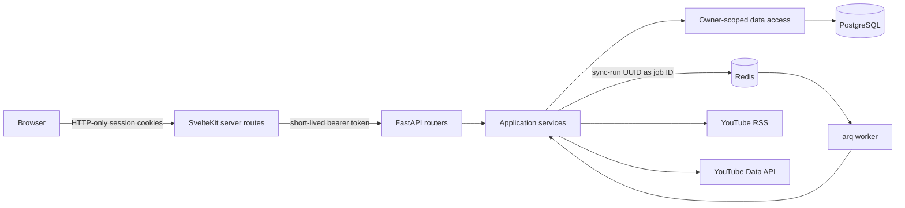
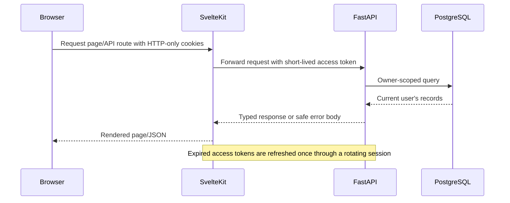
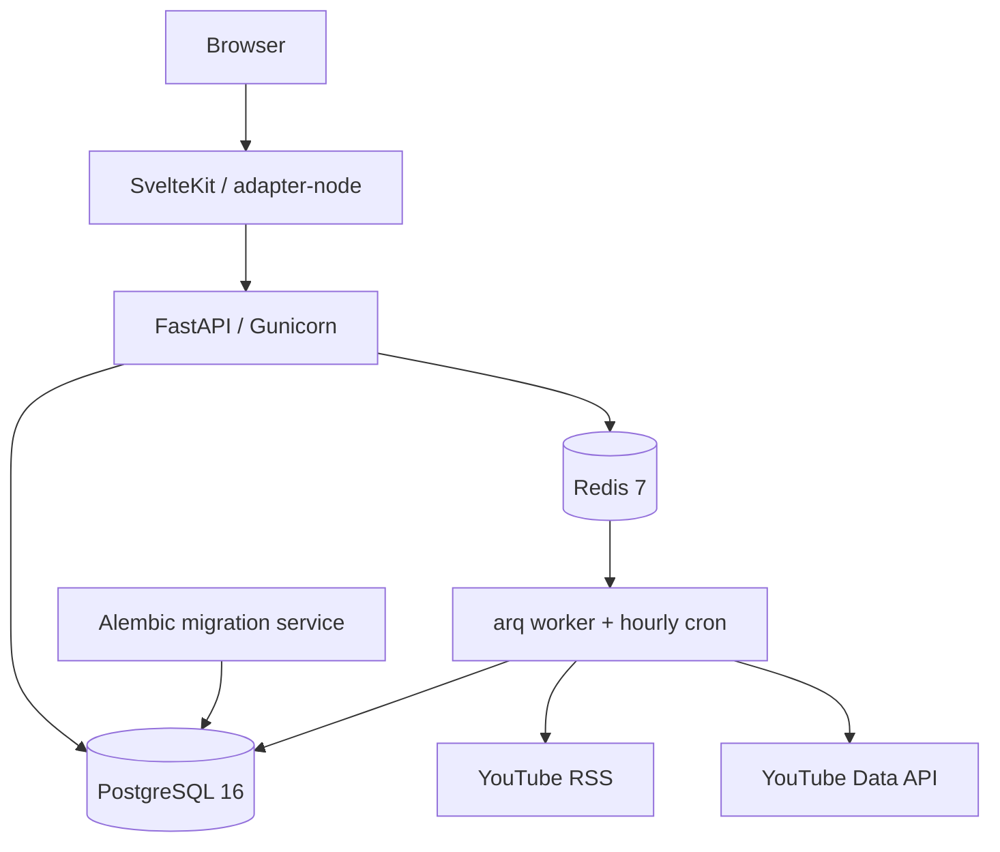
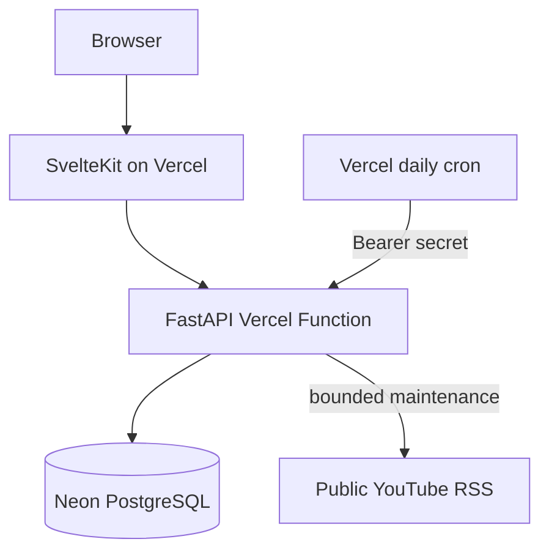

# Architecture

ChooseYourTube uses one application codebase for a complete Docker deployment and a restricted
recruiter-facing demo. Runtime configuration changes infrastructure requirements and permitted
operations; it does not fork product models, migrations or UI components.

## Component boundaries

- SvelteKit owns browser-facing authentication routes and proxies API requests so session cookies
  remain same-origin and HTTP-only.
- FastAPI routers validate HTTP input and delegate orchestration to services. Persistence stays in
  asynchronous CRUD modules.
- PostgreSQL stores accounts, channels, videos, categories, tags, playlists, imports, API usage and
  durable synchronization history.
- Redis carries full-mode jobs and the worker heartbeat. It is transport, not the source of truth for
  job status.
- arq workers execute idempotent refresh/import services and update PostgreSQL progress after each
  deliberate batch.

## Authenticated request flow

The browser never receives database credentials or Google OAuth tokens. A standard error contains a
stable code, safe message, request ID and retryability flag; detailed exceptions remain in logs.

## Synchronization flow

1. A command creates or reuses an owner-scoped `sync_run` in `queued` state.
2. The run UUID is also the arq job ID, preventing duplicate active delivery for the same work.
3. A worker atomically claims the run, records its attempt and executes an idempotent service.
4. RSS conditional requests detect changes before full mode spends YouTube Data API quota.
5. Upserts and unique source IDs make retries safe; counters are persisted as batches complete.
6. The run ends as `succeeded`, `partial` or `failed` with a safe error. Retryable failures use bounded
   backoff; credential and quota failures do not loop indefinitely.
7. The frontend polls the durable record and preserves the last successfully loaded content when a
   refresh fails.

The scheduler paginates through every followed channel and isolates per-channel failures so one bad
feed cannot stop other users' work.

## Data ownership

Core records carry an `owner_id`, and routers resolve the authenticated owner before calling services.
CRUD queries scope reads and writes by that owner. Cross-user identifiers therefore behave as missing
rather than revealing another account's data. Account deletion removes owned state transactionally.

Videos and channel metadata are currently duplicated per owner. This consumes more storage and may
repeat refresh work, but simplifies isolation, export and deletion and avoids shared-record lifecycle
coupling.

## Deployment topologies

### Full Docker application

This is the reference product: registration, CSV/OAuth import, channel mutation, manual refresh,
hourly scheduling and quota-accounted Data API enrichment are enabled.

### Hosted portfolio demo

The shared demo has no Redis, persistent worker or YouTube API key. Registration, imports, channel
mutation and manual external refresh are disabled by backend policy. Daily maintenance restores the
seeded state and attempts a bounded RSS-only update while preserving the last good dataset on failure.

Operational procedures are documented in [Deployment](deployment.md); the rationale for these
boundaries is documented in [Engineering decisions](engineering-decisions.md).
