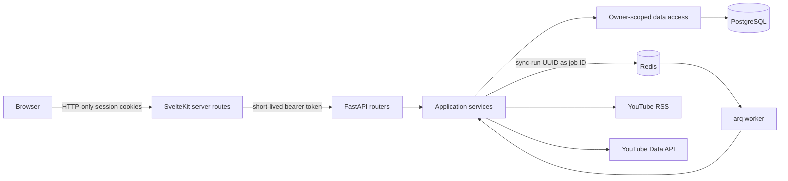
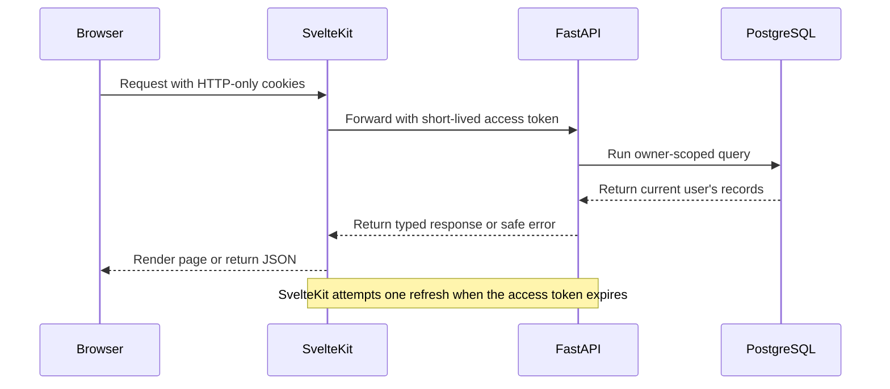
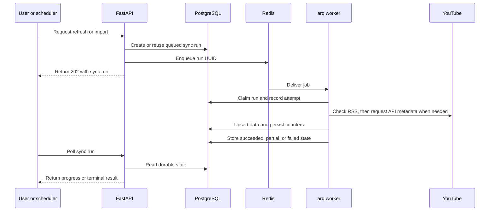
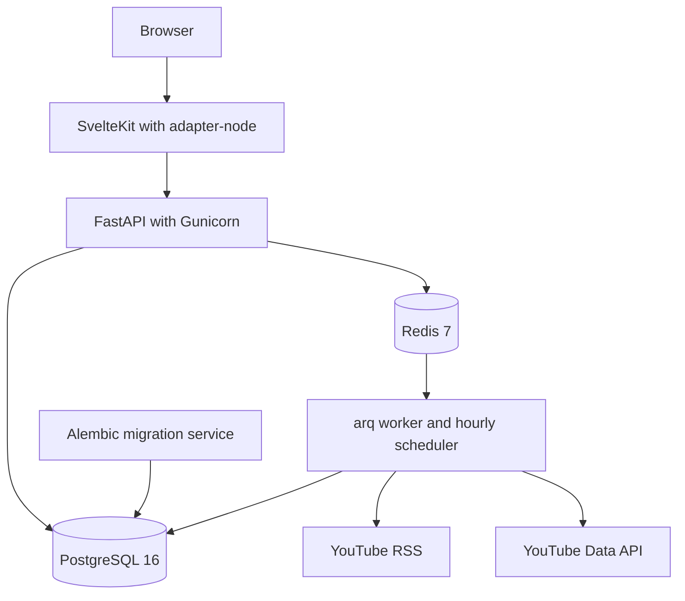

# Architecture

ChooseYourTube has one application codebase and two runtime configurations. The full Docker
installation includes background workers and YouTube Data API access. The hosted demo uses the same
models, services, migrations, and frontend components with a restricted set of operations.

## Components

SvelteKit renders the interface, handles browser-facing authentication, and proxies API requests.
This keeps access and refresh tokens in same-origin HTTP-only cookies.

FastAPI routers validate requests and call application services. Services coordinate data access,
external clients, and background jobs. Async CRUD modules contain database queries.

PostgreSQL stores accounts, channels, videos, categories, tags, playlists, imports, YouTube API usage,
and synchronization history. Redis carries queued work and the worker heartbeat; PostgreSQL remains
the durable record of job status.

## Authenticated request flow

The browser never receives database credentials or Google OAuth tokens. Public API errors contain a
stable code, safe message, request ID, and retryable flag. Detailed exceptions remain in structured
server logs.

## Synchronization flow

The run UUID is also the arq job ID, which prevents duplicate active delivery for the same work.
Workers claim runs atomically. Unique source IDs and upserts make retries safe.

RSS conditional requests use `ETag` and `Last-Modified` values to detect changes before full mode
spends Data API quota. Batch counters are committed as work progresses. Retryable failures use bounded
backoff; configuration, credential, and quota errors do not retry indefinitely.

The scheduler paginates across every followed channel and isolates channel failures. One unavailable
feed therefore does not stop unrelated refreshes. The frontend reads the PostgreSQL sync record and
keeps the last successfully loaded content visible when a refresh fails.

## Data ownership

Core application records include `owner_id`. Routers resolve the authenticated account before calling
services, and CRUD queries scope reads and writes to that owner. An identifier owned by another user
returns the same response as a missing identifier. Account deletion removes owned data in one
transaction.

Channel and video metadata is duplicated for each owner. This increases storage and can repeat refresh
work, but it keeps queries, exports, and deletion within one ownership model. The alternative would
require shared-record lifecycle and reference-counting rules.

## Full Docker installation

This is the reference product configuration. It supports registration, CSV and OAuth imports,
channel changes, manual refresh, hourly scheduling, and quota-accounted Data API metadata.

## Hosted demo

The shared demo has no Redis service, persistent worker, or YouTube API key. Backend policy disables
registration, imports, channel changes, and manual external refresh. Daily maintenance restores the
seeded state and attempts a bounded RSS update. The last stored dataset remains available when a feed
or maintenance request fails.

See [Deployment and self-hosting](deployment.md) for operational procedures and
[Engineering decisions](engineering-decisions.md) for the trade-offs behind these boundaries.
